# Anarchy
Anarchy is a learning institution initiative under the Spectra Vulnerability Research Group.


---
## ⚠️ Legal Disclaimer

**Important Notice:**  
All GIFs included in this repository are **sourced from Pinterest and other creators**.  

- The project author **does not own these GIFs**.  
- GIFs are included **strictly for educational, demonstration, or non-commercial purposes**.  
- Original creators retain **full copyright and ownership**.  
- By using this repository, you acknowledge that these GIFs **remain copyrighted material**.  
- If you are a copyright holder and object to the inclusion of your GIF, please contact the repository owner to request removal (see DMCA section below).  

This repository is designed for **transparency, proper attribution, and responsible use**.

---

## 📜 Copyright Statement

All GIFs in this repository are **copyrighted material** and are **not licensed for redistribution** or commercial use.  
Including them here **does not grant ownership** to the project author or users of this repository.

---

## 📝 Terms of Use

By accessing this repository, you agree that:

1. GIFs are used **for educational/demo purposes only**.  
2. You will **not claim ownership** of any GIFs.  
3. You will **not use the GIFs for commercial purposes** without permission from the original creator.  
4. You will respect all copyright and attribution guidelines of the original creators.

---

## 📂 GIF Gallery & Attribution

Below are thumbnails of the GIFs included in this project. Each links to the **original source**.

| GIF Preview | Name | Source | Notes |
|------------|------|--------|-------|
|  | gif1.gif | [Pinterest – Original Creator](https://www.pinterest.com/pin/651544271130108161/) | Local copy for demo |
|  | gif2.gif | [Pinterest – Original Creator](https://www.pinterest.com/pin/651544271130108209/) | Local copy for demo |
| 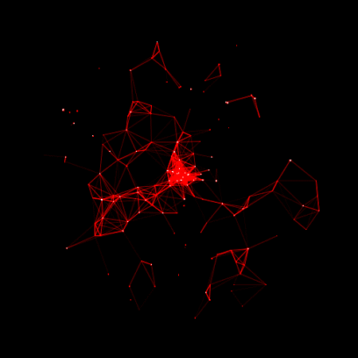 | gif3.gif | [Pinterest – Original Creator](https://www.pinterest.com/pin/326299935487704016/) | Local copy for demo |
| 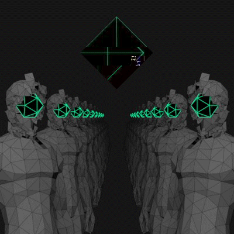 | gif1.gif | [Pinterest – Original Creator](https://www.pinterest.com/pin/651544271130108119/) | Local copy for demo |
| 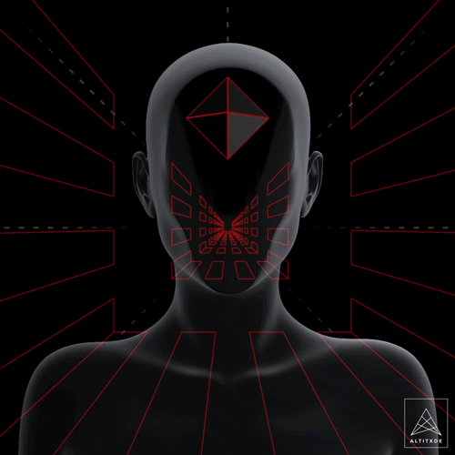 | gif2.gif | [Pinterest – Original Creator](https://www.pinterest.com/pin/651544271130108106/) | Local copy for demo |
| 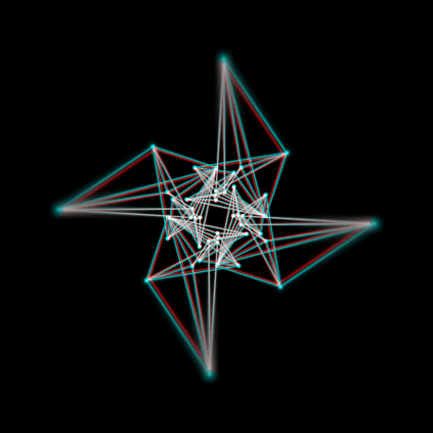 | gif3.gif | [Pinterest – Original Creator](https://www.pinterest.com/pin/651544271130108102/) | Local copy for demo |
|  | gif1.gif | [Pinterest – Original Creator](https://www.pinterest.com/pin/651544271130108131/) | Local copy for demo |
|  | gif2.gif | [Pinterest – Original Creator](https://www.pinterest.com/pin/651544271130108131/) | Local copy for demo |
| 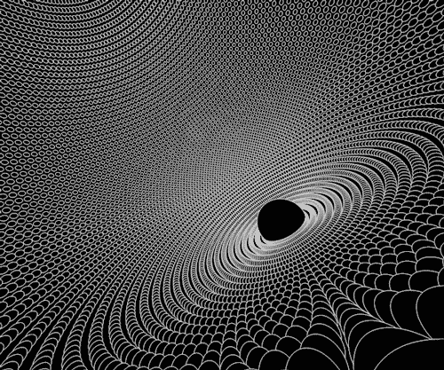 | gif3.gif | [Pinterest – Original Creator](https://www.pinterest.com/pin/651544271130108278/) | Local copy for demo |
|  | gif1.gif | [Pinterest – Original Creator](https://www.pinterest.com/pin/651544271130108144/) | Local copy for demo |
|  | gif2.gif | [Pinterest – Original Creator](https://www.pinterest.com/pin/651544271130108411/) | Local copy for demo |
|  | gif3.gif | [Pinterest – Original Creator](https://www.pinterest.com/pin/651544271130103798/) | Local copy for demo |
| 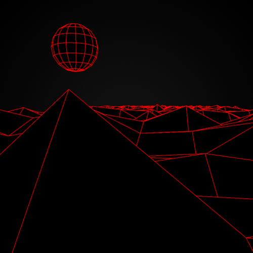 | gif1.gif | [Pinterest – Original Creator](https://www.pinterest.com/pin/651544271130108220/) | Local copy for demo |
|  | gif2.gif | [Pinterest – Original Creator](https://www.pinterest.com/pin/651544271130108267/) | Local copy for demo |
|  | gif3.gif | [Pinterest – Original Creator](https://www.pinterest.com/pin/651544271130108375/) | Local copy for demo |
| 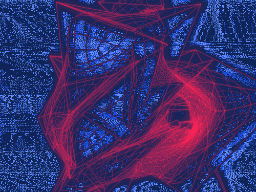 | gif3.gif | [Pinterest – Original Creator](https://www.pinterest.com/pin/651544271130108398/) | Local copy for demo |
| 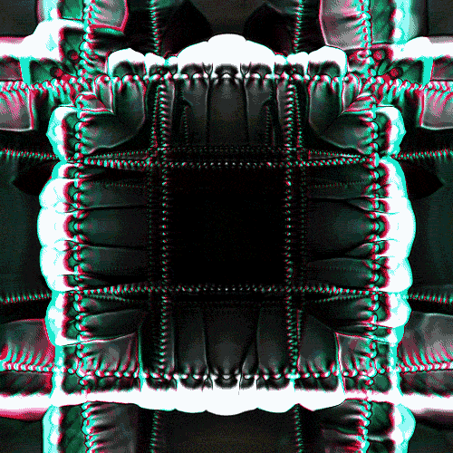 | gif1.gif | [Pinterest – Original Creator](https://www.pinterest.com/pin/651544271130108276/) | Local copy for demo |
|  | gif2.gif | [Pinterest – Original Creator](https://www.pinterest.com/pin/651544271130108333/) | Local copy for demo |
|  | gif3.gif | [Pinterest – Original Creator](https://www.pinterest.com/pin/651544271130108371/) | Local copy for demo |
| 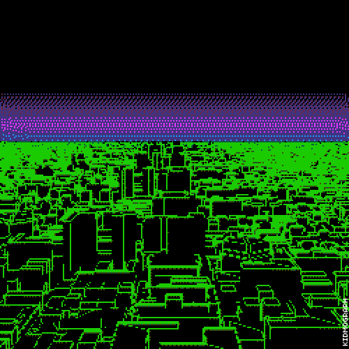 | gif1.gif | [Pinterest – Original Creator](https://www.pinterest.com/pin/651544271130108399/) | Local copy for demo |
|  | gif2.gif | [Pinterest – Original Creator](https://www.pinterest.com/pin/651544271130108377/) | Local copy for demo |
| 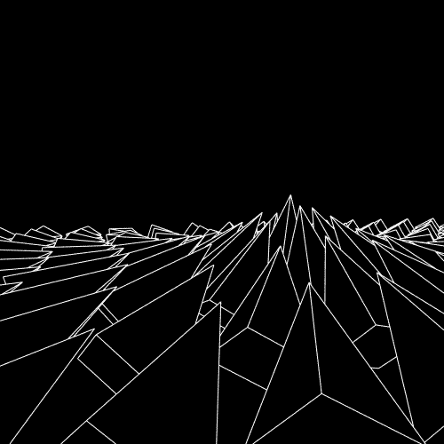 | gif3.gif | [Pinterest – Original Creator](https://www.pinterest.com/pin/651544271130108404/) | Local copy for demo |
| 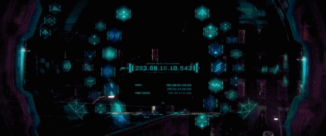 | gif2.gif | [Pinterest – Original Creator](https://www.pinterest.com/pin/651544271130108401/) | Local copy for demo |
|  | gif3.gif | [Pinterest – Original Creator](https://www.pinterest.com/pin/651544271130108367/) | Local copy for demo |

---

## 🗂 Usage in Project

All GIFs are stored in the `courseIframes` function and referenced **locally** in HTML:

```html
'adv-prompt-1': '<iframe src="https://assets.pinterest.com/ext/embed.html?id=651544271130108161" height="336" width="236" frameborder="0" scrolling="no" ></iframe>',
'win-exploit-1': '<iframe src="https://assets.pinterest.com/ext/embed.html?id=651544271130108209" height="277" width="236" frameborder="0" scrolling="no" ></iframe>',
'psyops-1': '<iframe src="https://assets.pinterest.com/ext/embed.html?id=326299935487704016" height="336" width="236" frameborder="0" scrolling="no" ></iframe>',
'llm-systems-engineering': '<iframe src="https://assets.pinterest.com/ext/embed.html?id=651544271130108119" height="336" width="236" frameborder="0" scrolling="no" ></iframe>',
'anonymity': '<iframe src="https://assets.pinterest.com/ext/embed.html?id=651544271130108106" height="336" width="236" frameborder="0" scrolling="no" ></iframe>',
'off-python': '<iframe src="https://assets.pinterest.com/ext/embed.html?id=651544271130108102" height="336" width="236" frameborder="0" scrolling="no" ></iframe>',
'off-c': '<iframe src="https://assets.pinterest.com/ext/embed.html?id=651544271130108131" height="336" width="236" frameborder="0" scrolling="no" ></iframe>',
'intell-anal': '<iframe src="https://assets.pinterest.com/ext/embed.html?id=651544271130108278" height="277" width="236" frameborder="0" scrolling="no" ></iframe>',
'asm': '<iframe src="https://assets.pinterest.com/ext/embed.html?id=651544271130108144" height="297" width="236" frameborder="0" scrolling="no" ></iframe>',
'v-disc': '<iframe src="https://assets.pinterest.com/ext/embed.html?id=651544271130108411" height="305" width="236" frameborder="0" scrolling="no" ></iframe>',
'geo-cyber-strat': '<iframe src="https://assets.pinterest.com/ext/embed.html?id=651544271130103798" height="277" width="236" frameborder="0" scrolling="no" ></iframe>',
'cog-war-app': '<iframe src="https://assets.pinterest.com/ext/embed.html?id=651544271130108220" height="277" width="236" frameborder="0" scrolling="no" ></iframe>',
'adv-ml': '<iframe src="https://assets.pinterest.com/ext/embed.html?id=651544271130108267" height="336" width="236" frameborder="0" scrolling="no" ></iframe>',
'ai-off-sec': '<iframe src="https://assets.pinterest.com/ext/embed.html?id=651544271130108375" height="279" width="236" frameborder="0" scrolling="no" ></iframe>',
'def-ai-sec': '<iframe src="https://assets.pinterest.com/ext/embed.html?id=651544271130108398" height="336" width="236" frameborder="0" scrolling="no" ></iframe>',
'apt': '<iframe src="https://assets.pinterest.com/ext/embed.html?id=651544271130108276" height="277" width="236" frameborder="0" scrolling="no" ></iframe>',
'shellcode': '<iframe src="https://assets.pinterest.com/ext/embed.html?id=651544271130108333" height="336" width="236" frameborder="0" scrolling="no" ></iframe>',
'comp': '<iframe src="https://assets.pinterest.com/ext/embed.html?id=651544271130108371" height="336" width="236" frameborder="0" scrolling="no" ></iframe>',
'embedded': '<iframe src="https://assets.pinterest.com/ext/embed.html?id=651544271130108399" height="336" width="236" frameborder="0" scrolling="no" ></iframe>',
'kernel': '<iframe src="https://assets.pinterest.com/ext/embed.html?id=651544271130108377" height="336" width="236" frameborder="0" scrolling="no" ></iframe>',
'win-internals': '<iframe src="https://assets.pinterest.com/ext/embed.html?id=651544271130108404" height="336" width="236" frameborder="0" scrolling="no" ></iframe>',
'hyperv-internals': '<iframe src="https://assets.pinterest.com/ext/embed.html?id=651544271130108401" height="336" width="236" frameborder="0" scrolling="no" ></iframe>',
'reversing': '<iframe src="https://assets.pinterest.com/ext/embed.html?id=651544271130108367" height="199" width="236" frameborder="0" scrolling="no" ></iframe>',
